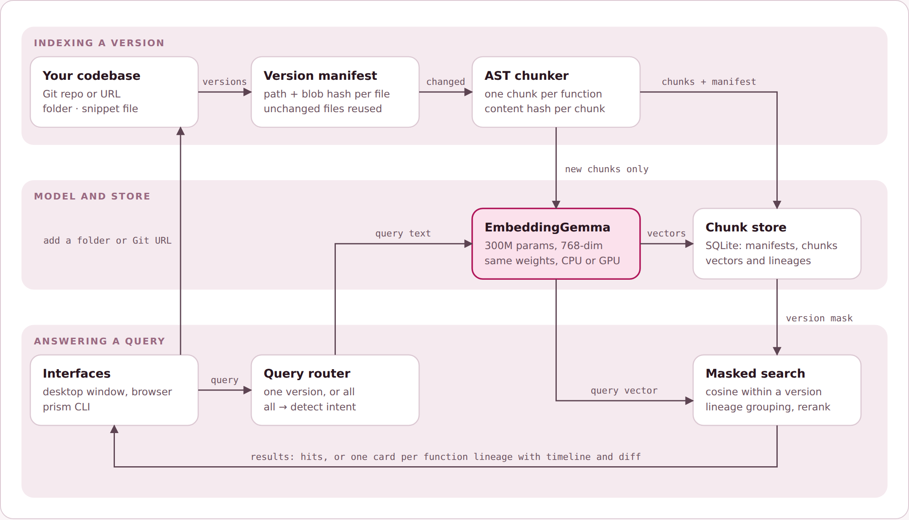

# CodeRetriever

Version-aware text-to-code retrieval for the Samsung PRISM Gen AI Hackathon, Theme 1 (Agentic Code Intelligence).

Describe what a piece of code does in plain language, and CodeRetriever ranks the matching code: on the AppsRetrieval benchmark, on any version of a codebase, or across every version at once.




Full diagrams: [docs/architecture.html](docs/architecture.html) (overview, incremental indexing, training and submission).

## Status

Development happens on `dev`; `main` is updated at each milestone.

| Goal | What it covers | Status |
|---|---|---|
| P0 | Retrieval accuracy on MTEB `AppsRetrieval` (NDCG@10, MRR) | Baselines measured; first fine-tune lost to the base model, so the base model stays; pipeline and submission script ready |
| P1 | Retrieval on any version, with fast incremental re-indexing | Implemented and tested |
| Bonus | Retrieval across all versions | Implemented and tested |
| App | Desktop app, local web app and CLI | Implemented |

The first fine-tune (`egemma-ft-v1`) scored below the base model on both dev and test, so it was not promoted and `models/embeddinggemma-apps-ft/` stays empty; everything runs on the base model. The submission file is `results/appsretrieval_results.json` (84.03 NDCG@10 on CPU).

## How it works

```text
query ──► query views (full / core / I-O spec) ──► EmbeddingGemma ──► exact cosine search ──► optional rerank ──► results
                                                                          ▲
codebase version ──► git ls-tree ──► AST chunks ──► content hash ──► embed only new chunks ──► SQLite chunk store
```

- **Embedding model:** EmbeddingGemma-300m (base weights; a fine-tuned checkpoint is used only if it beats the base model on dev). Small enough for CPU; runs in bf16 on a GPU.
- **P0 pipeline:** each query is embedded as weighted views (whole statement, story-only, I/O specification). For APPS-style problems, candidates can be checked against the examples in the statement and the passing ones promoted.
- **P1:** each file is identified by its Git blob hash and each function by a content hash, so a new version only embeds the functions that changed. A version is a manifest of hashes; searching a version masks the vectors to that manifest.
- **Bonus:** functions are linked into lineages across versions, following edits and file renames. A search over all versions returns one result per lineage with its version timeline and the diff that changed it. Mentioning a version ("in v2.31") or a change ("when was … added") routes the query automatically.
- **Devices:** CPU and GPU use the same embedding weights, so indexes stay valid when you switch. The GPU profile can add a reranker for the top results (`profiles.gpu.reranker`); it is off by default because Qwen3-Reranker-4B needs about 8 GB of VRAM for its weights alone.

## Findings so far

### Baseline embedding models on AppsRetrieval (test split)

| Model | Params | NDCG@10 | MRR@10 | Recall@10 | Recall@100 | Time* | Peak VRAM |
|---|---|---|---|---|---|---|---|
| **google/embeddinggemma-300m** | 308M | **84.05** | **80.73** | 94.3% | 99.5% | 3.7 min | 1.5 GB |
| Qwen/Qwen3-Embedding-0.6B | 596M | 75.92 | 71.75 | 89.0% | 98.2% | 7.0 min | 2.2 GB |

\*Full evaluation (8,765 solutions + 3,765 queries) on an RTX 4060 Laptop GPU, bf16, inputs capped at 2,048 tokens.

- Both scores match the published MTEB results (84.39 and 75.34), which validates the evaluation setup.
- The correct solution is in the top 100 for 99.5% of queries but ranked first only about 75% of the time, so the remaining gains are in ranking, not recall.
- On a 500-query dev set held out from the train split, the generic prompt (`task: search result`) scored 79.4 NDCG@10 vs 78.8 for the code prompt, so fine-tuning keeps the generic prompt.
- Only 1,650 train queries match the contest style of the test split (no starter code); fine-tuning uses 1,150 of them with 3 mined hard negatives each.
- Fine-tuning result (`egemma-ft-v1`: 1 epoch, 1,079 tuples, lr 1e-5, CachedMNRL, 161 min on the RTX 4060): dev NDCG@10 fell from 79.41 to 76.28, and test from 84.05 to 82.04 (MRR@10 80.73 to 78.56). The base model is kept. Likely causes: EmbeddingGemma is already strong on this task, and mined hard negatives in APPS include near-duplicate problems (false negatives).

### Submission run and query views

| Run | Device | NDCG@10 | MRR@10 | Recall@100 | Time |
|---|---|---|---|---|---|
| Pipeline encoder, full statement only (**submission**) | CPU, fp32 | **84.03** | **80.70** | 99.52% | 97.9 min |
| Pipeline encoder, full statement only | RTX 4060, bf16 | 84.05 | 80.73 | 99.52% | 4.4 min |
| + core view (0.5) | RTX 4060, bf16 | 82.10 | 78.60 | 99.28% | 5.3 min |
| + core (0.5) + I/O view (0.25) | RTX 4060, bf16 | 82.68 | 79.31 | 99.31% | 6.0 min |

- CPU fp32 matches the GPU score to within 0.02, so the CPU-first submission loses nothing.
- Adding story-only or I/O-only views to the query embedding lowers the score; the default stays at the full statement (`query_views: {full: 1.0}`), which was the configured default before these runs.
- The submission JSON is `results/appsretrieval_results.json`; attach it to a GitHub release.

### P1: re-indexing new versions (psf/requests, RTX 4060)

| Version | Files | Chunks | Newly embedded | Reused | Time (s) |
|---|---|---|---|---|---|
| v2.30.0 | 35 | 533 | 533 | 0.0% | 6.43 |
| v2.31.0 | 35 | 534 | 4 | 99.3% | 0.13 |
| v2.32.0 | 36 | 558 | 88 | 84.2% | 1.46 |
| v2.32.3 | 36 | 559 | 7 | 98.7% | 0.22 |

- Each later version re-embeds only the functions whose content changed; on average an incremental re-index is 10.7x faster than the first full index (`results/versions_benchmark.json`).
- Queries over the indexed versions answer in about 80–130 ms.

### Dataset notes

- `CoIR-Retrieval/apps`: 5,000 train and 3,765 test queries over one shared corpus of 8,765 Python solutions, one correct solution per query.
- Training uses only the train split; negatives are mined from train-split solutions only, so no test data enters training.

## Setup

Requirements: Python 3.10–3.13 and Git. An NVIDIA GPU is optional; everything also runs on CPU.

**1. Clone and create a virtual environment**

```powershell
git clone https://github.com/SOMASEKAR17/CodeRetriever.git
cd CodeRetriever
python -m venv .venv
.venv\Scripts\activate
```

On Linux or macOS, activate with `source .venv/bin/activate`.

**2. Install PyTorch**

```powershell
pip install torch --index-url https://download.pytorch.org/whl/cu130   # NVIDIA GPU
pip install torch                                                     # CPU only
```

Pick the CUDA index that matches your driver (`cu130`, `cu128`, `cu126`).

**3. Install CodeRetriever**

```powershell
pip install -r requirements.txt -r requirements-desktop.txt
pip install -e .
```

`requirements-desktop.txt` adds pywebview for the desktop window; skip it if you only use the browser or the CLI.

**4. Log in to Hugging Face (one time)**

EmbeddingGemma is a gated model. Accept its licence at https://huggingface.co/google/embeddinggemma-300m, create a read token, then:

```powershell
hf auth login
```

The model (about 1.2 GB) downloads on first use.

**Windows notes**

- If importing torch fails with `WinError 4551`, Smart App Control is blocking its DLLs; turn it off in Windows Security → App & browser control.
- The desktop window uses Microsoft Edge WebView2, which is preinstalled on Windows 10 and 11.

## Using the app

**Start it**

```powershell
prism desktop            # native window
prism serve              # same app in your browser at http://127.0.0.1:8765
prism --device cpu desktop
```

The first start loads the model, which takes a few seconds. Indexes are stored in `~/.prism` (set `PRISM_INDEX_DIR` to change this).

**1. Add a codebase.** Open **Codebases**, paste a Git HTTPS URL (it is cloned for you) or a folder path, or click **Browse** to pick a folder. Give it a name if you like and click **Add**.

**2. Index versions.** Open **Versions**, choose the codebase and click **Load versions** to list its tags and branches. Tick the versions you want and click **Index selected**. The table shows how many chunks were newly embedded and how many were reused from earlier versions. A plain folder indexes as a single snapshot.

**3. Search.** Open **Search**, describe what the code does in plain words, choose a version or **All versions**, and press **Search** or Ctrl+Enter.

- A single version returns the best-matching functions in that version.
- **All versions** returns one result per function with its version timeline. Questions such as "when was the retry limit changed" open the version where it changed, with the diff.
- Mentioning a version in the query ("parse_config in v1.2") searches that version only.

**Window and panels**

- ☰ (top left) opens the list of codebases; ⓘ (top right) opens details, indexed versions and recent activity. Both slide over the page; close them with ×, Esc or a click outside.
- **CPU / GPU** (top right) switches the device. Both use the same model, so existing indexes stay valid.
- In the desktop window the coloured buttons at the top left close, minimise and maximise; drag the top bar to move the window and double-click it to maximise.
- **Benchmarks** shows the AppsRetrieval scores and **Settings** shows the model, device and index folder.

## Using the CLI

```bash
prism add https://github.com/psf/requests.git --id requests
prism versions requests --available
prism index requests --refs v2.31.0 v2.32.0
prism search "how are redirects limited" --source requests --version v2.32.0
prism search "when was the redirect limit changed" --source requests --diff
prism bench-versions requests --refs v2.32.2 v2.32.3
```

`--version all` (the default) returns one result per function lineage with its version timeline; `--flat` returns raw chunks instead. Add `--device cpu|cuda` to choose the device and `--embedder hash` for a model-free smoke test.

## Configuration

`config.yaml` holds the model, devices and paths:

| Key | Meaning |
|---|---|
| `embedder.checkpoint` | Fine-tuned model folder (placeholder `models/embeddinggemma-apps-ft`); falls back to `embedder.base_model` while missing |
| `profiles.cpu` / `profiles.gpu` | Precision and optional reranker per device |
| `query_views` | Weights of the full / core / I-O query views |
| `execution_rerank` | Example-test reranking settings (APPS-style queries only) |
| `index_dir` | Where indexes are stored (default `~/.prism`) |

Environment overrides: `PRISM_CONFIG`, `PRISM_CHECKPOINT`, `PRISM_DEVICE`, `PRISM_INDEX_DIR`.

## Benchmark scripts

```bash
python scripts/prefetch.py --models google/embeddinggemma-300m
python scripts/run_mteb.py --model google/embeddinggemma-300m --device cuda --dtype bf16 --max-length 2048 --out-dir results --tag base
python scripts/finetune.py --out-dir runs/egemma-ft-v1
python scripts/run_pipeline_mteb.py --device cpu --out-dir results --tag submission
python scripts/run_pipeline_mteb.py --device cuda --mode search --execute-examples --out-dir results --tag exec
python scripts/bench_versions.py --index-dir runs/bench --refs v2.30.0 v2.31.0 v2.32.0 v2.32.3
```

- `run_pipeline_mteb.py` writes `<tag>_appsretrieval_results.json`, the MTEB result file uploaded with each GitHub release, using the `AbsEncoder` interface from the brief. `--mode search` uses MTEB's `SearchProtocol` for the example-test reranker.
- Example-test reranking runs candidate solutions on the examples in the problem statement. It is only used on benchmark snippets, never on user repositories.

## Docker

```bash
docker build -t coderetriever .
docker run -p 8765:8765 -e HF_TOKEN=<your read token> -v coderetriever-data:/data coderetriever
```

## Tests

```bash
python -m unittest discover -s tests -v
```

The tests build a small Git repository with edits and a rename, and check incremental reuse, per-version search, lineages, intent routing, query views and example-test reranking. They use a hash embedder, so they need no model or GPU.

## Project layout

```text
src/prism/
  config.py        configuration, device profiles, placeholder model path
  sources.py       Git, folder and JSONL snippet sources
  chunker.py       AST chunking for Python, line windows for other languages
  store.py         SQLite chunk store and version manifests
  vector_index.py  in-memory vectors with per-version masks
  engine.py        indexing and search
  evolution.py     lineages, version-intent routing, all-version search
  preprocess.py    query views and example parsing
  execution.py     example-test reranking
  reranker.py      Qwen3 reranker for the GPU profile
  embedder.py      EmbeddingGemma wrapper and hash embedder
  mteb_adapter.py  MTEB encoder and search wrappers
  server.py        local JSON API
  desktop.py       desktop window
  cli.py           command line
  static/          app UI
scripts/           evaluation, training and benchmark scripts
tests/             unit tests
models/            fine-tuned weights (not in git)
```
